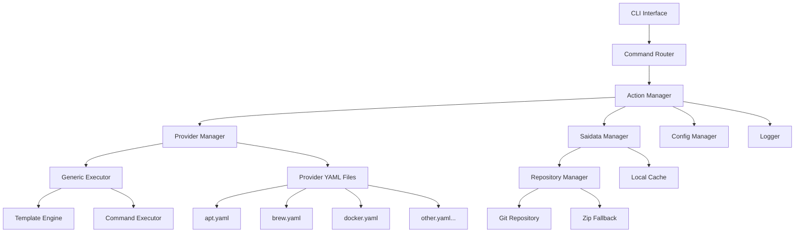

# Design Document

## Overview

The SAI CLI application is designed as a modular Go application that provides a unified interface for software management across different operating systems and package managers. The architecture follows a provider-based pattern where different providers (apt, brew, docker, etc.) implement common software management operations through a standardized interface.

The application uses a hierarchical saidata structure to define software metadata and provider-specific configurations, enabling automatic provider detection and cross-platform compatibility. The design emphasizes modularity, extensibility, and maintainability while providing a consistent user experience across different platforms.

### Dynamic Provider Architecture Benefits

The key innovation of this design is the **dynamic provider system** where all provider logic is defined in YAML files rather than hardcoded Go implementations. This approach provides several advantages:

1. **Zero-Code Provider Addition**: New providers can be added by simply creating a YAML file in the providers directory
2. **Runtime Flexibility**: Provider behavior can be modified without recompiling the application
3. **Community Contributions**: Non-Go developers can contribute providers using familiar YAML syntax
4. **Rapid Prototyping**: New provider concepts can be tested quickly without code changes
5. **Maintenance Simplification**: Provider updates don't require application releases
6. **Configuration-Driven**: All provider logic is declarative and version-controlled

### Intelligent Defaults System

When saidata is not available for a given software, the system employs intelligent defaults with safety validation:

#### Default Generation Rules

1. **Package Names**: Use the software name as the default package name
2. **Service Names**: Use the software name as the default service name  
3. **Configuration Files**: Generate paths like `/etc/{software}/{software}.conf`
4. **Log Files**: Generate paths like `/var/log/{software}.log` or `/var/log/{software}/{software}.log`
5. **Data Directories**: Generate paths like `/var/lib/{software}` or `/opt/{software}`
6. **Command Paths**: Check common locations like `/usr/bin/{software}`, `/usr/local/bin/{software}`
7. **Ports**: Use well-known port assignments when available

#### Safety Validation

Before executing any action, the system validates that referenced resources actually exist:

- **File Operations**: Check if files exist before attempting to read/modify them
- **Service Operations**: Verify services are installed before managing them  
- **Command Operations**: Confirm executables exist before running them
- **Directory Operations**: Validate directories exist before accessing them

#### Fallback Behavior

```go
// Example workflow for 'sai config nginx' without saidata
1. Generate default config paths: ["/etc/nginx/nginx.conf", "/etc/nginx.conf"]
2. Check which files actually exist on the system
3. If no config files exist, return "No configuration files found for nginx"
4. If files exist, proceed with the config action using existing files
```

This approach ensures that SAI remains useful even without comprehensive saidata while preventing errors from referencing non-existent resources.

## Architecture

### High-Level Architecture



### Core Components

1. **CLI Interface**: Built using Cobra framework for command parsing and flag handling
2. **Command Router**: Routes commands to appropriate action handlers
3. **Action Manager**: Orchestrates software management operations
4. **Provider Manager**: Dynamically loads and manages providers from YAML files
5. **Generic Executor**: Executes provider actions based on YAML configuration without hardcoded logic
6. **Template Engine**: Renders command templates with saidata and runtime variables
7. **Command Executor**: Executes system commands with proper error handling and logging
8. **Saidata Manager**: Manages software metadata and configurations
9. **Repository Manager**: Handles saidata repository operations (Git/Zip)
10. **Config Manager**: Manages application configuration
11. **Logger**: Provides structured logging with verbosity control

## Components and Interfaces

### CLI Layer

```go
// Root command structure using Cobra
type RootCmd struct {
    Config     string
    Provider   string
    Verbose    bool
    DryRun     bool
    Yes        bool
    Quiet      bool
    JSON       bool
}

// Command categories with specific behaviors per requirements
type SoftwareCommands struct {
    // Software lifecycle (Requirements 1, 2)
    Install, Uninstall, Upgrade, Search, Info, Version
    // Service management (Requirement 3)
    Start, Stop, Restart, Enable, Disable, Status
    // Monitoring and troubleshooting (Requirement 4)
    Logs, Config, Check, CPU, Memory, IO
}

type GeneralCommands struct {
    // System overview (Requirement 5)
    List, Logs, CPU, Memory, IO // Without software parameter
    // Batch and system operations (Requirement 6)
    Apply, Stats, Saidata
}

// Command behavior specifications
type CommandBehavior struct {
    RequiresConfirmation bool   // Requirement 9.1, 9.2
    SupportsProviderSelection bool // Requirement 1.3, 2.1
    ExecutesAcrossProviders bool   // Requirement 2.3, 2.4, 2.5
    ShowsInstallationStatus bool   // Requirement 2.5
}

// Provider selection and user interaction
type ProviderSelector interface {
    SelectProvider(software string, action string, availableProviders []*Provider, preferredProvider string) (*Provider, error)
    ShowProviderOptions(software string, providers []*ProviderOption) (*Provider, error)
    ConfirmAction(action string, software string, provider string, commands []string) (bool, error)
}

type ProviderOption struct {
    Provider    *Provider
    PackageName string
    Version     string
    IsInstalled bool
}
```

### Dynamic Provider System

```go
// Provider represents a dynamically loaded provider from YAML
type Provider struct {
    Data     *ProviderData
    Executor *GenericExecutor
}

// ProviderManager handles dynamic provider loading and management
type ProviderManager interface {
    LoadProviders(providerDir string) error
    GetProvider(name string) (*Provider, error)
    GetAvailableProviders() []*Provider
    SelectProvider(software string, action string, preferredProvider string) (*Provider, error)
    IsProviderAvailable(name string) bool
}

// GenericExecutor executes provider actions with safety validation
type GenericExecutor interface {
    Execute(provider *ProviderData, action string, software string, saidata *SoftwareData, options ExecuteOptions) (*Result, error)
    ValidateAction(provider *ProviderData, action string, software string, saidata *SoftwareData) error
    ValidateResources(saidata *SoftwareData, action string) (*ValidationResult, error)
    DryRun(provider *ProviderData, action string, software string, saidata *SoftwareData, options ExecuteOptions) (*Result, error)
    CanExecute(provider *ProviderData, action string, software string, saidata *SoftwareData) bool
}

type ValidationResult struct {
    Valid           bool
    MissingFiles    []string
    MissingServices []string
    MissingCommands []string
    Warnings        []string
    CanProceed      bool
}

// Resource validator for safety checks
type ResourceValidator interface {
    ValidateFile(file File) bool
    ValidateService(service Service) bool
    ValidateCommand(command Command) bool
    ValidateDirectory(directory Directory) bool
    ValidatePort(port Port) bool
}

type ExecuteOptions struct {
    DryRun    bool
    Verbose   bool
    Timeout   time.Duration
    Variables map[string]string
}

type Result struct {
    Success     bool
    Output      string
    Error       error
    ExitCode    int
    Duration    time.Duration
    Commands    []string
    Provider    string
}

// Output formatting and user interface
type OutputFormatter interface {
    FormatCommand(command string, provider string) string
    FormatCommandOutput(output string, exitCode int) string
    FormatProviderName(provider string) string
    FormatJSON(data interface{}) string
    ShowProgress(message string)
    ShowError(err error)
    ShowSuccess(message string)
}

type UserInterface interface {
    ShowProviderSelection(software string, options []*ProviderOption) (*Provider, error)
    ConfirmAction(action string, software string, provider string, commands []string) (bool, error)
    ShowCommandPreview(commands []string, provider string)
    IsQuietMode() bool
    IsVerboseMode() bool
}
```

### Saidata Management with Intelligent Defaults

```go
type SaidataManager interface {
    LoadSoftware(name string) (*SoftwareData, error)
    GetProviderConfig(software string, provider string) (*ProviderConfig, error)
    GenerateDefaults(software string) (*SoftwareData, error)
    UpdateRepository() error
    SearchSoftware(query string) ([]*SoftwareInfo, error)
    ValidateData(data []byte) error
    ManageRepositoryOperations() error // Requirement 6.3 - saidata repository management
    SynchronizeRepository() error      // Requirement 6.3 - repository synchronization
}

type DefaultsGenerator interface {
    GeneratePackageDefaults(software string) []Package
    GenerateServiceDefaults(software string) []Service
    GenerateFileDefaults(software string) []File
    GenerateDirectoryDefaults(software string) []Directory
    GenerateCommandDefaults(software string) []Command
    GeneratePortDefaults(software string) []Port
    ValidatePathExists(path string) bool
    ValidateServiceExists(service string) bool
    ValidateCommandExists(command string) bool
}

type SoftwareData struct {
    Version      string                 `yaml:"version"`
    Metadata     Metadata              `yaml:"metadata"`
    Packages     []Package             `yaml:"packages"`
    Services     []Service             `yaml:"services"`
    Files        []File                `yaml:"files"`
    Directories  []Directory           `yaml:"directories"`
    Commands     []Command             `yaml:"commands"`
    Ports        []Port                `yaml:"ports"`
    Containers   []Container           `yaml:"containers"`
    Providers    map[string]ProviderConfig `yaml:"providers"`
    Compatibility Compatibility        `yaml:"compatibility"`
    IsGenerated  bool                  `yaml:"-"` // Indicates if this is generated defaults
}

// Enhanced data structures with validation
type File struct {
    Name     string `yaml:"name"`
    Path     string `yaml:"path"`
    Type     string `yaml:"type"`
    Owner    string `yaml:"owner,omitempty"`
    Group    string `yaml:"group,omitempty"`
    Mode     string `yaml:"mode,omitempty"`
    Backup   bool   `yaml:"backup,omitempty"`
    Exists   bool   `yaml:"-"` // Runtime validation flag
}

type Service struct {
    Name        string   `yaml:"name"`
    ServiceName string   `yaml:"service_name"`
    Type        string   `yaml:"type"`
    Enabled     bool     `yaml:"enabled,omitempty"`
    ConfigFiles []string `yaml:"config_files,omitempty"`
    IsActive    bool     `yaml:"-"` // Runtime status flag
    Exists      bool     `yaml:"-"` // Runtime validation flag
}

type Command struct {
    Name           string   `yaml:"name"`
    Path           string   `yaml:"path"`
    Arguments      []string `yaml:"arguments,omitempty"`
    Aliases        []string `yaml:"aliases,omitempty"`
    ShellCompletion bool    `yaml:"shell_completion,omitempty"`
    ManPage        string   `yaml:"man_page,omitempty"`
    Exists         bool     `yaml:"-"` // Runtime validation flag
}
```

### Action Management

```go
type ActionManager interface {
    ExecuteAction(action string, software string, options ActionOptions) (*ActionResult, error)
    ValidateAction(action string, software string) error
    GetAvailableActions(software string) ([]string, error)
    GetActionInfo(action string) (*ActionInfo, error)
    ResolveSoftwareData(software string) (*SoftwareData, error) // Returns saidata or intelligent defaults
    ValidateResourcesExist(saidata *SoftwareData, action string) (*ValidationResult, error)
    GetAvailableProviders(software string, action string) ([]*ProviderOption, error)
    RequiresConfirmation(action string) bool
    SearchAcrossProviders(software string) ([]*SearchResult, error) // Requirement 2.3 - search across all providers
    GetSoftwareInfo(software string) ([]*SoftwareInfo, error)       // Requirement 2.4 - info across all providers
    GetSoftwareVersions(software string) ([]*VersionInfo, error)    // Requirement 2.5 - version info with install status
    ManageRepositorySetup(saidata *SoftwareData) error              // Requirement 8.5 - automatic repository setup
}

type ActionOptions struct {
    Provider    string
    DryRun      bool
    Verbose     bool
    Quiet       bool
    Yes         bool
    JSON        bool
    Config      string
    Variables   map[string]string
}

type ActionResult struct {
    Action      string
    Software    string
    Provider    string
    Success     bool
    Output      string
    Error       error
    Duration    time.Duration
    Commands    []string
    Changes     []Change
    ExitCode    int
    RequiredConfirmation bool // Requirement 9.1, 9.2 - track if action required confirmation
}

// Search and info result structures for cross-provider operations
type SearchResult struct {
    Software    string
    Provider    string
    PackageName string
    Version     string
    Description string
    Available   bool
}

type SoftwareInfo struct {
    Software    string
    Provider    string
    PackageName string
    Version     string
    Description string
    Homepage    string
    License     string
    Dependencies []string
}

type VersionInfo struct {
    Software    string
    Provider    string
    PackageName string
    Version     string
    IsInstalled bool // Requirement 2.5 - highlight installation status
    LatestVersion string
}

// Command validation and execution control
type CommandValidator interface {
    CanExecuteCommand(command string, provider *Provider, software string) bool
    ValidateCommandTemplate(template string, saidata *SoftwareData) error
    GetExecutableCommands(provider *Provider, action string, software string, saidata *SoftwareData) ([]string, error)
}
```

### Configuration Management

```go
type Config struct {
    SaidataRepository string            `yaml:"saidata_repository"`
    DefaultProvider   string            `yaml:"default_provider"`
    ProviderPriority  map[string]int    `yaml:"provider_priority"`
    Timeout           time.Duration     `yaml:"timeout"`
    CacheDir          string            `yaml:"cache_dir"`
    LogLevel          string            `yaml:"log_level"`
    Confirmations     ConfirmationConfig `yaml:"confirmations"`
    Output            OutputConfig      `yaml:"output"`
    Repository        RepositoryConfig  `yaml:"repository"`
}

// Repository configuration for Git-based management with zip fallback (Requirement 8.4)
type RepositoryConfig struct {
    GitURL          string        `yaml:"git_url"`
    ZipFallbackURL  string        `yaml:"zip_fallback_url"`
    LocalPath       string        `yaml:"local_path"`
    UpdateInterval  time.Duration `yaml:"update_interval"`
    OfflineMode     bool          `yaml:"offline_mode"`
    AutoSetup       bool          `yaml:"auto_setup"`
}

type ConfirmationConfig struct {
    Install       bool `yaml:"install"`       // Requirement 9.1 - system-changing operations require confirmation
    Uninstall     bool `yaml:"uninstall"`     // Requirement 9.1 - system-changing operations require confirmation
    Upgrade       bool `yaml:"upgrade"`       // Requirement 9.1 - system-changing operations require confirmation
    SystemChanges bool `yaml:"system_changes"` // Requirement 9.1 - system-changing operations require confirmation
    ServiceOps    bool `yaml:"service_ops"`   // Requirement 9.1 - service start/stop/restart/enable/disable require confirmation
    InfoCommands  bool `yaml:"info_commands"` // Requirement 9.2 - info commands execute without confirmation (default: false)
}

type OutputConfig struct {
    ProviderColor    string `yaml:"provider_color"`
    CommandStyle     string `yaml:"command_style"`
    SuccessColor     string `yaml:"success_color"`
    ErrorColor       string `yaml:"error_color"`
    ShowCommands     bool   `yaml:"show_commands"`
    ShowExitCodes    bool   `yaml:"show_exit_codes"`
}
```

## Repository Management

### Git-Based Saidata Management with Zip Fallback

**Design Decision**: Implement a dual-mode repository system that primarily uses Git for saidata management but falls back to zip downloads for offline scenarios.

**Rationale**: Requirement 8.4 mandates Git-based management with zip fallback, enabling both connected and offline workflows while maintaining data integrity and version control.

```go
type RepositoryManager interface {
    InitializeRepository() error
    UpdateRepository() error
    SynchronizeRepository() error
    ValidateRepository() error
    GetRepositoryStatus() (*RepositoryStatus, error)
    SetupSoftwareRepositories(saidata *SoftwareData) error // Requirement 8.5
    IsOfflineMode() bool
    SwitchToZipFallback() error
}

type RepositoryStatus struct {
    Type           string    // "git" or "zip"
    LastUpdate     time.Time
    LocalPath      string
    RemoteURL      string
    IsHealthy      bool
    Version        string
    CommitHash     string    // For git repositories
    FileCount      int
    SizeBytes      int64
}

// Automatic repository setup for software-defined repositories (Requirement 8.5)
type SoftwareRepositoryManager interface {
    SetupRepositories(software string, saidata *SoftwareData) error
    ValidateRepositoryAccess(repo Repository) error
    ConfigurePackageManager(provider string, repositories []Repository) error
    CleanupRepositories(software string) error
}

type Repository struct {
    Name        string   `yaml:"name"`
    URL         string   `yaml:"url"`
    Type        string   `yaml:"type"`        // "apt", "yum", "brew", etc.
    GPGKey      string   `yaml:"gpg_key,omitempty"`
    Priority    int      `yaml:"priority,omitempty"`
    Enabled     bool     `yaml:"enabled"`
    Components  []string `yaml:"components,omitempty"` // For apt repositories
    Distribution string  `yaml:"distribution,omitempty"` // For apt repositories
}
```

### Repository Workflow

1. **Initialization**: Check for existing Git repository, clone if needed, fallback to zip if Git unavailable
2. **Updates**: Pull latest changes from Git, re-download zip if in fallback mode
3. **Validation**: Verify repository integrity and schema compliance
4. **Software Repository Setup**: Automatically configure package manager repositories based on saidata definitions
5. **Offline Support**: Graceful degradation to cached data when network unavailable

## Data Models

### Dynamic Provider Loading

```go
// ProviderLoader handles loading provider configurations from YAML files
type ProviderLoader interface {
    LoadFromFile(filepath string) (*ProviderData, error)
    LoadFromDirectory(dirpath string) ([]*ProviderData, error)
    ValidateProvider(data *ProviderData) error
    WatchDirectory(dirpath string, callback func(*ProviderData)) error
}

// Provider availability detection
type ProviderDetector interface {
    IsAvailable(provider *ProviderData) bool
    GetPlatform() string
    GetArchitecture() string
    CheckExecutable(executable string) bool
    CheckCommand(command string) bool
}

// Enhanced ProviderData structure
type ProviderData struct {
    Version  string                 `yaml:"version"`
    Provider ProviderInfo          `yaml:"provider"`
    Actions  map[string]Action     `yaml:"actions"`
    Mappings Mappings              `yaml:"mappings,omitempty"`
}

type ProviderInfo struct {
    Name         string   `yaml:"name"`
    DisplayName  string   `yaml:"display_name"`
    Description  string   `yaml:"description"`
    Type         string   `yaml:"type"`
    Platforms    []string `yaml:"platforms"`
    Capabilities []string `yaml:"capabilities"`
    Priority     int      `yaml:"priority,omitempty"`
    Executable   string   `yaml:"executable,omitempty"`
}

type Action struct {
    Description   string            `yaml:"description"`
    Template      string            `yaml:"template,omitempty"`
    Command       string            `yaml:"command,omitempty"`
    Script        string            `yaml:"script,omitempty"`
    Steps         []Step            `yaml:"steps,omitempty"`
    RequiresRoot  bool              `yaml:"requires_root"`
    Timeout       int               `yaml:"timeout"`
    Retry         *RetryConfig      `yaml:"retry,omitempty"`
    Validation    *Validation       `yaml:"validation,omitempty"`
    Rollback      string            `yaml:"rollback,omitempty"`
    Variables     map[string]string `yaml:"variables,omitempty"`
    Detection     string            `yaml:"detection,omitempty"`
}
```

### Template Engine with Safety Checks

```go
type TemplateEngine interface {
    Render(template string, data interface{}) (string, error)
    RegisterFunction(name string, fn interface{})
    ValidateTemplate(template string) error
    SetSafetyMode(enabled bool) // Prevents execution if resources don't exist
}

// Template Function Context
// All sai_* template functions have implicit access to the current SoftwareData context
// The saidata parameter has been removed from function signatures for cleaner templates

// Enhanced template functions with existence validation
func sai_package(provider string, index ...int) string
func sai_packages(provider string) []string
func sai_service(name string) string
func sai_port(index ...int) int
func sai_file(name string) string
func sai_directory_path(name string) string
func sai_command_path(name string) string

// Safety validation functions
func file_exists(path string) bool
func service_exists(service string) bool
func command_exists(command string) bool
func directory_exists(path string) bool

// Default generation functions
func default_config_path(software string) string      // /etc/{software}/{software}.conf
func default_log_path(software string) string         // /var/log/{software}.log
func default_data_dir(software string) string         // /var/lib/{software}
func default_service_name(software string) string     // {software}
func default_command_path(software string) string     // /usr/bin/{software}
```

## Output Formatting and User Experience

### Command Display and Execution Flow

The design addresses Requirement 10's specific output formatting needs through a comprehensive output management system:

**Design Decision**: Implement a structured output formatter that provides consistent visual feedback throughout command execution, ensuring users always understand what's happening and can track success/failure states.

**Rationale**: Clear visual feedback is critical for system administration tools where users need to understand exactly what commands are being executed and their outcomes, especially in automated environments.

```go
type CommandExecutionFlow struct {
    PreExecution   func(command string, provider string)     // Show command in bold before execution
    PostExecution  func(output string, exitCode int)         // Show output and status
    ProviderDisplay func(provider string) string             // Format provider name with background color
    ErrorDisplay   func(err error)                          // Show errors in red
    SuccessDisplay func(message string)                      // Show success in green
}

// Output formatting implementation
type ConsoleFormatter struct {
    config       *OutputConfig
    colorEnabled bool
    quietMode    bool
    verboseMode  bool
}

func (f *ConsoleFormatter) FormatCommand(command string, provider string) string {
    // Bold text for commands before execution (Requirement 10.1)
    providerTag := f.FormatProviderName(provider)
    return fmt.Sprintf("%s %s", providerTag, f.bold(command))
}

func (f *ConsoleFormatter) FormatProviderName(provider string) string {
    // Configurable background color for provider names (Requirement 10.2)
    return f.colorBackground(provider, f.config.ProviderColor)
}

func (f *ConsoleFormatter) FormatCommandOutput(output string, exitCode int) string {
    // Normal text output followed by colored exit status (Requirement 10.3)
    status := f.formatExitStatus(exitCode)
    return fmt.Sprintf("%s\n%s", output, status)
}

func (f *ConsoleFormatter) formatExitStatus(exitCode int) string {
    if exitCode == 0 {
        return f.colorText("✓ Success", f.config.SuccessColor)
    }
    return f.colorText(fmt.Sprintf("✗ Failed (exit code: %d)", exitCode), f.config.ErrorColor)
}
```

### Provider Selection Interface

**Design Decision**: Implement an interactive provider selection system that shows detailed information about each available provider option, including package names and installation status.

**Rationale**: When multiple providers are available (Requirement 1.3), users need sufficient information to make informed decisions about which provider to use.

```go
type ProviderSelectionUI struct {
    formatter OutputFormatter
    input     InputReader
}

func (ui *ProviderSelectionUI) ShowProviderOptions(software string, options []*ProviderOption) (*Provider, error) {
    // Display provider options with package names and versions (Requirement 1.3)
    fmt.Printf("Multiple providers available for %s:\n\n", software)
    
    for i, option := range options {
        status := "Available"
        if option.IsInstalled {
            status = ui.formatter.colorText("Installed", "green")
        }
        
        fmt.Printf("%d. %s\n", i+1, ui.formatter.FormatProviderName(option.Provider.Name))
        fmt.Printf("   Package: %s\n", option.PackageName)
        fmt.Printf("   Version: %s\n", option.Version)
        fmt.Printf("   Status:  %s\n\n", status)
    }
    
    return ui.promptForSelection(options)
}
```

### Command Confirmation System

**Design Decision**: Implement a context-aware confirmation system that distinguishes between system-changing operations and information-only commands.

**Rationale**: Requirements 9.1 and 9.2 mandate different confirmation behaviors - system-changing operations require confirmation by default, while information-only commands execute immediately.

```go
type ConfirmationManager interface {
    RequiresConfirmation(action string, software string) bool
    PromptForConfirmation(action string, software string, provider string, commands []string) (bool, error)
    IsSystemChangingAction(action string) bool
    IsInformationOnlyAction(action string) bool
    BypassConfirmation(options ActionOptions) bool // --yes flag handling
}

// System-changing actions that require confirmation (Requirement 9.1)
var SystemChangingActions = []string{
    "install", "uninstall", "upgrade",
    "start", "stop", "restart", "enable", "disable",
    "apply", // batch operations
}

// Information-only actions that execute without confirmation (Requirement 9.2)
var InformationOnlyActions = []string{
    "search", "info", "version", "status",
    "logs", "config", "check", "cpu", "memory", "io",
    "list", "stats", "saidata",
}

func (cm *ConfirmationManager) RequiresConfirmation(action string, software string) bool {
    // Skip confirmation for information-only actions (Requirement 9.2)
    if cm.IsInformationOnlyAction(action) {
        return false
    }
    
    // Require confirmation for system-changing actions (Requirement 9.1)
    if cm.IsSystemChangingAction(action) {
        return true
    }
    
    return false
}
```

### Command Validation and Safety

**Design Decision**: Implement comprehensive command validation that prevents execution of commands with unavailable providers or non-existent software.

**Rationale**: Requirement 10.5 mandates that only executable commands should be shown and executed, preventing user confusion and system errors.

```go
type SafetyValidator struct {
    providerDetector ProviderDetector
    resourceValidator ResourceValidator
}

func (v *SafetyValidator) CanExecuteCommand(command string, provider *Provider, software string) bool {
    // Check provider availability
    if !v.providerDetector.IsAvailable(provider.Data) {
        return false
    }
    
    // Validate template resolution
    if err := v.validateTemplateResolution(command, software); err != nil {
        return false
    }
    
    // Check resource existence
    return v.resourceValidator.ValidateResources(software)
}

func (v *SafetyValidator) GetExecutableCommands(provider *Provider, action string, software string, saidata *SoftwareData) ([]string, error) {
    var executableCommands []string
    
    for _, command := range provider.GetCommands(action) {
        if v.CanExecuteCommand(command, provider, software) {
            executableCommands = append(executableCommands, command)
        }
    }
    
    return executableCommands, nil
}
```

### Exit Code Management

**Design Decision**: Implement centralized exit code management that tracks all command executions and returns appropriate exit codes based on overall success/failure.

**Rationale**: Requirement 10.4 specifies that SAI should return exit code 1 if any command fails, and 0 if all succeed, which is critical for automation and scripting.

```go
type ExecutionTracker struct {
    commands    []CommandExecution
    overallSuccess bool
}

type CommandExecution struct {
    Command   string
    Provider  string
    ExitCode  int
    Success   bool
    Output    string
}

func (t *ExecutionTracker) TrackExecution(command string, provider string, exitCode int, output string) {
    execution := CommandExecution{
        Command:  command,
        Provider: provider,
        ExitCode: exitCode,
        Success:  exitCode == 0,
        Output:   output,
    }
    
    t.commands = append(t.commands, execution)
    
    if exitCode != 0 {
        t.overallSuccess = false
    }
}

func (t *ExecutionTracker) GetFinalExitCode() int {
    if t.overallSuccess {
        return 0
    }
    return 1
}
```

## Error Handling

### Error Types

```go
type ErrorType int

const (
    ErrorTypeValidation ErrorType = iota
    ErrorTypeProvider
    ErrorTypeExecution
    ErrorTypeConfiguration
    ErrorTypeNetwork
    ErrorTypePermission
    ErrorTypeTimeout
)

type SAIError struct {
    Type     ErrorType
    Message  string
    Cause    error
    Context  map[string]interface{}
    Software string
    Provider string
    Action   string
}

func (e *SAIError) Error() string
func (e *SAIError) Unwrap() error
func (e *SAIError) Is(target error) bool
```

### Error Recovery

- Automatic retry with exponential backoff for transient failures
- Rollback mechanisms for failed installations
- Graceful degradation when providers are unavailable
- Clear error messages with actionable suggestions

## Batch Operations and Schema Validation

### Apply Command Implementation

**Design Decision**: Implement a comprehensive batch operation system that can execute multiple software management actions from YAML/JSON files with proper validation and error handling.

**Rationale**: Requirement 6.1 and 6.4 require batch operations with schema validation, enabling automation and infrastructure-as-code workflows.

```go
type BatchProcessor interface {
    ProcessApplyFile(filepath string, options BatchOptions) (*BatchResult, error)
    ValidateApplyFile(filepath string) (*ValidationResult, error)
    ExecuteBatch(actions []BatchAction, options BatchOptions) (*BatchResult, error)
}

type BatchAction struct {
    Action   string                 `yaml:"action" json:"action"`
    Software string                 `yaml:"software" json:"software"`
    Provider string                 `yaml:"provider,omitempty" json:"provider,omitempty"`
    Options  map[string]interface{} `yaml:"options,omitempty" json:"options,omitempty"`
}

type BatchOptions struct {
    DryRun      bool
    Verbose     bool
    ContinueOnError bool
    Parallel    bool
    MaxConcurrency int
}

type BatchResult struct {
    TotalActions    int
    SuccessfulActions int
    FailedActions   int
    Results         []ActionResult
    Duration        time.Duration
    OverallSuccess  bool
}

// Schema validation for apply files
type SchemaValidator interface {
    ValidateApplyData(data []byte) error
    ValidateSaiData(data []byte) error
    ValidateProviderData(data []byte) error
    LoadSchema(schemaPath string) error
}
```

### Cross-Provider Operations

**Design Decision**: Implement cross-provider search, info, and version commands that aggregate results from all available providers without requiring user confirmation.

**Rationale**: Requirements 2.3, 2.4, and 2.5 specify that search, info, and version commands should execute across all providers automatically, providing comprehensive information to users.

```go
type CrossProviderManager interface {
    SearchAllProviders(software string) ([]*SearchResult, error)     // Requirement 2.3
    GetInfoAllProviders(software string) ([]*SoftwareInfo, error)    // Requirement 2.4
    GetVersionAllProviders(software string) ([]*VersionInfo, error)  // Requirement 2.5
    AggregateResults(results []interface{}) (interface{}, error)
    FilterAvailableProviders(software string, action string) ([]*Provider, error)
}

func (cpm *CrossProviderManager) SearchAllProviders(software string) ([]*SearchResult, error) {
    var allResults []*SearchResult
    
    // Execute search across all available providers without confirmation (Requirement 2.3)
    for _, provider := range cpm.GetAvailableProviders() {
        if provider.SupportsAction("search") {
            results, err := cpm.executeSearch(provider, software)
            if err != nil {
                // Log error but continue with other providers
                continue
            }
            allResults = append(allResults, results...)
        }
    }
    
    return allResults, nil
}

func (cpm *CrossProviderManager) GetVersionAllProviders(software string) ([]*VersionInfo, error) {
    var allVersions []*VersionInfo
    
    // Show version for all providers with installation status highlighted (Requirement 2.5)
    for _, provider := range cpm.GetAvailableProviders() {
        if provider.SupportsAction("version") {
            version, err := cpm.getVersionInfo(provider, software)
            if err != nil {
                continue
            }
            // Highlight installation status (Requirement 2.5)
            version.IsInstalled = cpm.checkInstallationStatus(provider, software)
            allVersions = append(allVersions, version)
        }
    }
    
    return allVersions, nil
}
```

### Statistics and System Information

**Design Decision**: Implement comprehensive system statistics that provide insights into available providers, actions, and system capabilities.

**Rationale**: Requirement 6.2 requires detailed statistics about the system state, which is essential for system administrators to understand their environment.

```go
type StatsCollector interface {
    GetProviderStats() (*ProviderStats, error)
    GetSystemStats() (*SystemStats, error)
    GetSoftwareStats() (*SoftwareStats, error)
    GetActionStats() (*ActionStats, error)
}

type ProviderStats struct {
    TotalProviders     int
    AvailableProviders int
    ProvidersByType    map[string]int
    ProvidersByPlatform map[string]int
    TopProviders       []ProviderInfo
}

type SystemStats struct {
    Platform           string
    Architecture       string
    OS                 string
    OSVersion          string
    InstalledSoftware  int
    RunningServices    int
    AvailableActions   int
}

type SoftwareStats struct {
    TotalSoftware      int
    InstalledSoftware  int
    SoftwareByProvider map[string]int
    RecentlyInstalled  []SoftwareInfo
}
```

## Testing Strategy

### Unit Testing

- **Provider Loader Tests**: Test YAML provider loading and validation
- **Generic Executor Tests**: Mock command execution for testing action workflows
- **Saidata Tests**: Validate saidata parsing and template rendering
- **CLI Tests**: Test command parsing and flag handling
- **Template Tests**: Verify template function behavior and edge cases
- **Provider Detection Tests**: Test platform and executable detection logic
- **Output Formatting Tests**: Validate command display, provider formatting, and exit status display
- **Provider Selection Tests**: Test interactive provider selection UI and user prompts
- **Command Validation Tests**: Verify command executability checks and safety validation
- **Batch Processing Tests**: Test apply file processing and schema validation
- **Statistics Tests**: Validate stats collection and system information gathering

### Integration Testing

- **Provider Integration**: Test real provider interactions in isolated environments
- **Repository Tests**: Test Git and Zip repository operations
- **End-to-End Tests**: Full workflow testing with real software installations
- **Cross-Platform Tests**: Validate behavior across different operating systems
- **User Interface Tests**: Test provider selection flows and confirmation prompts
- **Batch Operation Tests**: Test complete apply workflows with real action files
- **Output Integration Tests**: Validate formatted output in different terminal environments

### Test Structure

```go
// Mock command executor for testing
type MockCommandExecutor struct {
    responses map[string]*CommandResult
    executed  []string
}

// Mock provider detector for testing
type MockProviderDetector struct {
    platform     string
    architecture string
    executables  map[string]bool
}

// Integration test helpers
type TestEnvironment struct {
    TempDir      string
    ConfigFile   string
    CacheDir     string
    ProviderDir  string
    MockRepo     string
}

// Test data generators
func GenerateTestSaidata(software string) *SoftwareData
func GenerateTestProviderYAML(name string) string
func CreateTestProviderFile(dir, name string) string
func SetupTestEnvironment() *TestEnvironment
```

### Testing Scenarios

1. **Happy Path Testing**: Standard operations with valid inputs
2. **Error Scenarios**: Network failures, permission errors, invalid configurations
3. **Edge Cases**: Empty saidata, missing providers, conflicting configurations
4. **Performance Testing**: Large saidata repositories, concurrent operations
5. **Security Testing**: Input validation, privilege escalation prevention
6. **Provider Selection Testing**: Multiple provider scenarios, user choice validation
7. **Cross-Provider Testing**: Search, info, and version commands across multiple providers (Requirements 2.3, 2.4, 2.5)
8. **Confirmation Testing**: System-changing vs information-only command behavior (Requirements 9.1, 9.2)
9. **Repository Management Testing**: Git operations with zip fallback scenarios (Requirement 8.4)
10. **Automatic Repository Setup**: Software-defined repository configuration (Requirement 8.5)
11. **Installation Status Testing**: Version command highlighting of installed packages (Requirement 2.5)
12. **Batch Operation Testing**: Apply command with schema validation (Requirements 6.1, 6.4)ion
7. **Output Formatting Testing**: Different terminal types, color support, quiet/verbose modes
8. **Command Validation Testing**: Unavailable providers, missing executables, template resolution failures
9. **Batch Processing Testing**: Large apply files, mixed success/failure scenarios, schema validation errors
10. **Cross-Platform UI Testing**: Provider selection and confirmation prompts across different operating systems

## Implementation Phases

### Phase 1: Core Infrastructure
- CLI framework setup with Cobra
- Basic configuration management
- Logging infrastructure
- Provider interface definition

### Phase 2: Dynamic Provider System
- Provider loader for YAML-based provider definitions
- Generic executor for provider actions
- Provider detection and availability checking
- Dynamic provider selection logic
- Command execution framework with template rendering

### Phase 3: Saidata Integration
- Saidata parsing and validation
- Template engine implementation
- Repository management (Git/Zip)
- Local caching system

### Phase 4: User Interface and Output Management
- Output formatting system with configurable colors and styles
- Provider selection interface with detailed information display
- Command validation and safety checking
- Confirmation prompts and user interaction flows
- Exit code management and execution tracking

### Phase 5: Advanced Features
- Batch operations (apply command) with schema validation
- Statistics and reporting system
- Performance monitoring actions
- Error recovery and rollback mechanisms
- Comprehensive system information gathering

### Phase 6: Polish and Optimization
- Comprehensive testing including UI and output formatting
- Performance optimization
- Cross-platform validation and testing
- Documentation and user guides
- Final integration testing and validation